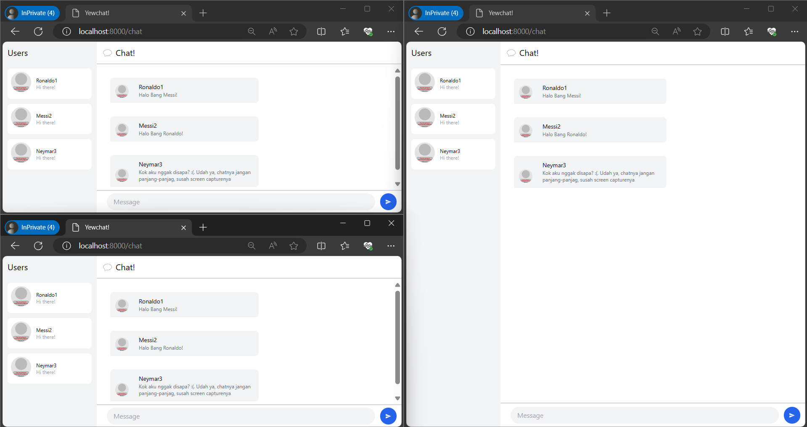
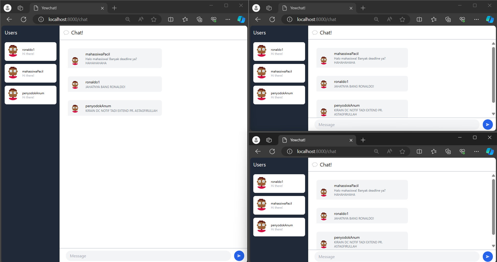

# _Original code_

Ketika saya menjalankan npm start dan menjalankan servernya juga, maka setiap _user_ bisa saling terhubung

# Add some creativities to the webclient

Saya melakukan beberapa perubahan pada _page_ _chat_ sehingga dapat sesuai dengan apa yang saya mau. Berikut adalah beberapa perubahan yang saya lakukan:
1. Mengganti _background_ warna _side bar_. Saya menggantinya warnya agar sesuai dengan warna pada halaman _login_.
2. Mengganti warna tulisan Users menjadi putih. Hal itu saya lakukan karena terdapat perubahan pada _background_-nya.
3. Mengganti url avatar. Di kode sebelumnya, _endpoint_ yang digunakan telah _outdated_, sehingga saya menggantinya dengan url _endpoint_ yang baru.